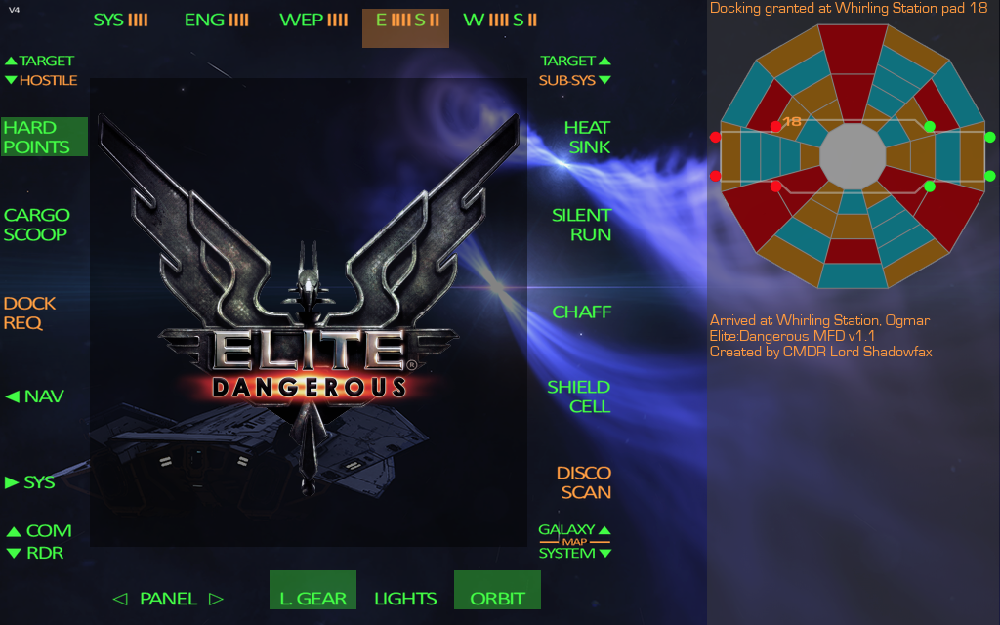

Custom build interactive panel for Elite:Dangerous with Thrustmaster MFD Cougar
- required libraries
  - pygame
  - watchdog
  - requests
  
How it works
- AHK (AutoHotKey) is used to interact with this application by sending Ctrl key combinations directly to it
- AHK is also used for scripting of key sequences, such as prescribed PIP controls, Docking Request and Disco(very) Scan
- AHK script mfd-start.ahk can be used to start the application and move it to desired position on screen such as a secondary display
- The main application (mfd.py) is started with one optional argument which controls the scaling of the application (default size is 1280 x 800)

Sample Screenshots:

